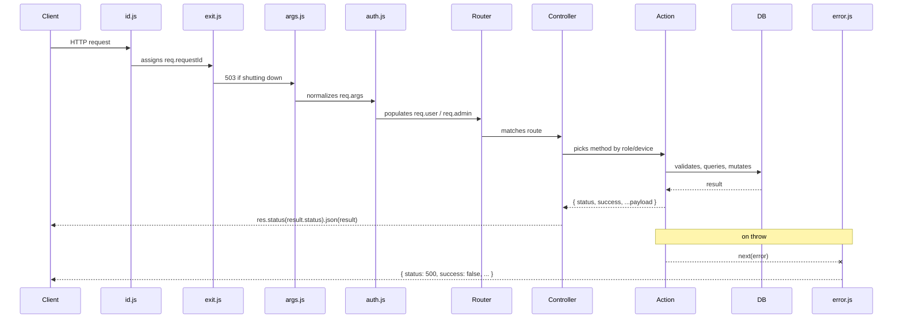

# Request Lifecycle

Every HTTP request that enters Orbital-Express travels through the same sequence of layers before a response is sent back. Understanding this flow end-to-end lets you reason about where your code runs, what `req` properties are available, and where errors should be handled.

---

## Flow Diagram



ASCII alternative for environments that do not render Mermaid:

```
Client
  │
  ▼
[1] middleware/id.js          — req.requestId = crypto.randomUUID()
  │                              X-Request-ID header set
  ▼
[2] middleware/exit.js        — returns 503 if server is shutting down
  │
  ▼
[3] middleware/args.js        — req.args = req.body (POST) or req.query (GET)
  │                              optional ?lang= sets locale
  ▼
[4] middleware/auth.js        — reads Authorization header
  │                              populates req.user or req.admin (or neither)
  ▼
[5] Feature routes.js         — matches URL to controller method
  │
  ▼
[6] Feature controller.js     — picks action by role/device, returns 401 if no access
  │
  ▼
[7] Feature actions/V1*.js    — Joi validation, business logic, DB query/mutation
  │
  ▼
[8] Return { status, success, ...payload }
  │
  ▼                           — on throw anywhere in [7]:
[error] middleware/error.js   — logs and returns { status: 500, success: false, ... }
```

---

## Step-by-Step Breakdown

### 1. `middleware/id.js` — Request ID

The very first middleware stamps a UUID on every request:

```javascript
function requestId(req, res, next) {
  req.requestId = crypto.randomUUID();
  res.setHeader('X-Request-ID', req.requestId);
  next();
}
```

`req.requestId` is available for the rest of the lifecycle. The error middleware echoes it back in 500 responses so that clients can quote it in bug reports and you can grep server logs by it. Every log line in an action or task should include `req.requestId` for the same reason.

---

### 2. `middleware/exit.js` — Graceful Shutdown Guard

If the server has received a SIGTERM and is draining connections, this middleware short-circuits with a 503 before the request goes any further:

```javascript
function middleware(req, res, next) {
  if (!isShuttingDown)
    return next();

  res.set('Connection', 'close');
  return res.status(503).json(errorResponse(req, ERROR_CODES.SERVICE_UNAVAILABLE));
}
```

Normal requests fall straight through to the next middleware.

---

### 3. `middleware/args.js` — `req.args` Normalization

This is the middleware responsible for `req.args`, the single source of truth for all incoming parameters throughout the rest of the lifecycle.

```javascript
function attach(req, res, next) {
  req.args = req.method === 'GET' ? req.query : req.body;

  if (req.args.lang) {
    req.setLocale(req.args.lang);
    res.setLocale(req.args.lang);
    delete req.args.lang;
  }

  return next();
}
```

**Why `req.args` exists.** Express splits incoming data across two objects — `req.body` for POST and `req.query` for GET — and there is no guarantee a client will always use the same method. Actions should never have to check which one to read from. `args.js` collapses both into `req.args` so every action reads the same property regardless of HTTP method. The framework only uses POST and GET, and `router.all()` registers every route for both — so actions must never read `req.body` or `req.query` directly.

**Language detection.** If `req.args.lang` is present, `args.js` sets the request and response locale immediately, then removes the key from `req.args` so it does not leak into validation schemas.

#### Filter parsing — `args.filters`

Query actions that support server-side filtering use a bracket-notation convention that maps directly to Sequelize operators. The `filters` middleware, registered on query routes, transforms the flattened keys into nested Sequelize operator objects:

```
Input (GET query string or POST body):
  { 'age[gte]': 18, 'age[lt]': 65, status: 'active' }

After args.filters:
  {
    age: { [Op.gte]: 18, [Op.lt]: 65 },
    status: 'active'
  }
```

The supported operators are `eq`, `ne`, `gt`, `lt`, `gte`, `lte` — matching Sequelize's `Op.*` equivalents. The mapping lives in `helpers/cruqd.js`:

```javascript
const OPERATORS = ['eq', 'ne', 'gt', 'lt', 'gte', 'lte'];

const SEQUELIZE_OPERATORS = {
  eq: Op.eq,
  ne: Op.ne,
  gt: Op.gt,
  lt: Op.lt,
  gte: Op.gte,
  lte: Op.lte
};
```

This means a query action can pass `req.args` directly into a Sequelize `where` clause after filters have been applied — no manual operator translation needed.

---

### 4. `middleware/auth.js` — JWT Authentication

Auth middleware reads the `Authorization` header, identifies the user type from the scheme prefix, runs the matching Passport strategy, and attaches the authenticated record to the correct key on `req`.

```javascript
const AUTH_TYPES = [
  { scheme: 'jwt-user',  strategy: 'JWTAuthUser',  reqKey: 'user' },
  { scheme: 'jwt-admin', strategy: 'JWTAuthAdmin', reqKey: 'admin' }
];
```

The process is split across two functions registered sequentially:

**`JWTAuth`** — runs the Passport strategy matching the header scheme. If no recognized scheme is present, it calls `next()` and the request continues unauthenticated. Routes that require auth enforce it in the controller, not here — this middleware is intentionally permissive.

**`verifyJWTAuth`** — after Passport runs, `req.user` holds the authenticated record regardless of type (Passport always writes to `req.user`). This function moves it to the correct key:

```javascript
function verifyJWTAuth(req, res, next) {
  if (req.user) {
    req.setLocale(req.user.locale);
    res.setLocale(req.user.locale);

    const authType = getAuthType(req);
    if (authType && authType.reqKey !== 'user') {
      req[authType.reqKey] = req.user; // e.g. req.admin = req.user
      req.user = null;
    }
  }

  res.cookie('i18n-locale', req.getLocale(), { maxAge: 999999, httpOnly: true });
  return next();
}
```

After this runs, you can check `req.user` (authenticated regular user), `req.admin` (authenticated admin), or neither (public/unauthenticated request). The controller is where the access decision is made.

---

### 5. Feature `routes.js` — URL Matching

Each feature folder defines its own `routes.js` that maps URL paths to controller methods. All routes are registered with `router.all()` so they accept any HTTP method — typically POST or GET in practice.

URL convention: **lowercase, no separators, version first, pluralized feature name, action name lowercased**:

```javascript
router.all('/v1/users/login',      controller.V1Login);
router.all('/v1/users/update',     controller.V1Update);
router.all('/v1/users/logoutall',  controller.V1LogoutAll);
```

The URL path is entirely predictable from the action name: strip the version prefix, lowercase it, no hyphens or underscores. `V1LogoutAll` → `/v1/users/logoutall`, not `/v1/users/logout-all` or `/v1/users/logout_all`.

All feature route files are aggregated into the global `routes.js` at startup. You must manually register a new feature's routes there after generating the folder.

---

### 6. Feature `controller.js` — Role and Device Dispatch

The controller is a thin routing layer. Its only job is to inspect `req` to determine which action to call, reject the request immediately if the caller has no access, and return the result. No business logic lives here.

```javascript
/**
 * Update and return updated user
 *
 * /v1/users/update
 *
 * Must be logged in
 * Roles: ['admin', 'user']
 */
async function V1Update(req, res, next) {
  let method = null;

  if (req.admin)
    method = 'V1UpdateByAdmin';
  else if (req.user)
    method = 'V1UpdateByUser';
  else
    return res.status(401).json(errorResponse(req, ERROR_CODES.UNAUTHORIZED));

  try {
    const result = await actions[method](req, res);
    return res.status(result.status).json(result);
  } catch (error) {
    return next(error);
  }
} // END V1Update
```

Three invariants that every controller method must respect:

1. **Auth rejection happens before the action is called.** If the caller's role is not in the allowed set, return `401` immediately. The action itself never needs to check who is calling.
2. **The action returns a plain object.** `{ status, success, ...payload }`. The controller sends it via `res.status(result.status).json(result)`. The action never calls `res` directly for the successful response path.
3. **Errors are forwarded to error middleware.** The `try/catch` passes any thrown error to `next(error)`, which routes it to `middleware/error.js`. Never swallow errors in the controller.

Controller method names follow a strict convention: **version + action name only**. Role and device suffixes belong on the action methods inside the action files, not on the controller method:

```
Controller method:   V1Update                          ← no role/device here
Action methods:      V1UpdateByAdmin, V1UpdateByUser   ← role lives here
```

---

### 7. Feature `actions/V1*.js` — Business Logic

The action is where all real work happens: input validation, database queries, queue enqueuing, socket emissions, and assembling the response payload.

An action receives `req` (and optionally `res` — though it should not use it for the response), does its work, and returns a plain result object. It never writes to `res` directly on the success path.

#### Joi validation

Every action validates `req.args` with Joi before touching the database:

```javascript
const schema = Joi.object({
  userId: Joi.string().uuid().required(),
  name:   Joi.string().min(1).max(255).optional()
});

const { error, value } = schema.validate(req.args);
if (error)
  return errorResponse(req, ERROR_CODES.BAD_REQUEST_INVALID_ARGUMENTS, joiErrorsMessage(error));
```

#### Database interaction

Actions query through the global `models` object, never by importing a model directly:

```javascript
const models = require('../../models');

const user = await models.user.findByPk(req.args.userId);
if (!user)
  return errorResponse(req, ERROR_CODES.USER_BAD_REQUEST_USER_NOT_FOUND);
```

#### Returning a response

The action returns a flat object. The controller sends it:

```javascript
return {
  status: 200,
  success: true,
  user: updatedUser
};
```

---

## The Response Shape

Every successful response is a flat object with no nesting under a `data` key:

```javascript
// correct
{ status: 200, success: true, user: { id: '...', name: '...' } }

// incorrect — never nest under data
{ status: 200, success: true, data: { user: { ... } } }
```

**Status codes by operation:**

| Status | When to use |
|--------|-------------|
| `200` | Default — read, update, any operation that completes synchronously |
| `201` | Record was created |
| `202` | Work was handed off to a background job; the job ID is in the payload |

The `202` pattern looks like this:

```javascript
// action enqueues background work and returns immediately
const job = await queue.get('OrderQueue').add('V1ProcessOrderTask', { orderId: order.id });

return {
  status: 202,
  success: true,
  jobId: job.id
};
```

The client receives `jobId` immediately and can poll or listen for a socket event when the job completes.

---

## Error Flow

There are two distinct error paths depending on where in the lifecycle the error occurs.

### Client errors (4xx) — `errorResponse()`

Business-rule rejections and validation failures are not thrown. The action returns an `errorResponse()` object, which the controller sends directly to the client:

```javascript
// inside an action
if (!user)
  return errorResponse(req, ERROR_CODES.USER_BAD_REQUEST_USER_NOT_FOUND);

// errorResponse returns:
// { success: false, status: 404, error: 'USER_BAD_REQUEST_USER_NOT_FOUND', message: '...' }
```

The controller sends it the same way it sends a success:

```javascript
const result = await actions[method](req, res);
return res.status(result.status).json(result); // works for both success and errorResponse
```

### Server errors (5xx) — `throw` → `middleware/error.js`

Unhandled exceptions — database connection failures, unexpected nulls, anything that should not happen — are thrown (not returned). The controller's `try/catch` catches them and forwards to `next(error)`:

```javascript
try {
  const result = await actions[method](req, res);
  return res.status(result.status).json(result);
} catch (error) {
  return next(error); // → middleware/error.js
}
```

`middleware/error.js` is the four-argument Express error handler registered last in `server.js`. It logs the error with the request ID and responds with a 500:

```javascript
// production
{ status: 500, success: false, error: err.name, message: err.message, requestId: req.requestId }

// development / test — includes stack, route, user context, and req.args for debugging
{ status: 500, success: false, error: err.name, stack: err.stack, message: err.message,
  requestId: req.requestId, reqRoute: req.url, reqUserType: '...', reqUser: {...}, reqArgs: {...} }
```

**Never return a 500 manually from an action or controller.** Let unexpected errors propagate. `middleware/error.js` is the single place responsible for 500 responses.

### Tasks — `throw` only

Background tasks (running in the worker process, outside the HTTP lifecycle) have no `res` object. They use `throw` for all errors — both business-rule failures and unexpected exceptions. The worker's Bull error/stall handlers route to `services/error.js queueError()`, which handles logging and (in production) alerting.

---

## Summary Reference

| Layer | File | Adds to req | Rule |
|-------|------|-------------|------|
| Request ID | `middleware/id.js` | `req.requestId` | Always present; include in every log line |
| Shutdown guard | `middleware/exit.js` | — | Returns 503 if draining |
| Args normalization | `middleware/args.js` | `req.args` | Never read `req.body` or `req.query` in actions |
| Authentication | `middleware/auth.js` | `req.user` / `req.admin` | Middleware is permissive; controller enforces auth |
| Route matching | `app/*/routes.js` | — | URL = lowercase action name, no separators |
| Role dispatch | `app/*/controller.js` | — | Auth rejection before action; action returns plain object |
| Business logic | `app/*/actions/V1*.js` | — | Return flat `{ status, success, ...payload }` |
| Error handling | `middleware/error.js` | — | Last middleware; never call manually |
