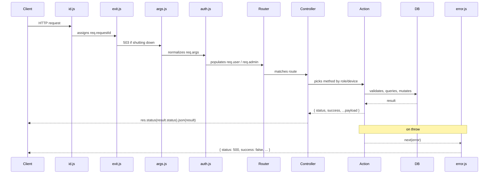

# 請求生命週期

每個進入 Orbital-Express 的 HTTP 請求，在送出回應之前，都會經過相同的層級序列。完整理解這個流程，讓你能夠推斷你的程式碼在哪裡執行、`req` 上有哪些屬性可用，以及錯誤應該在哪裡處理。

---

## 流程圖



不支援 Mermaid 的環境可使用以下 ASCII 替代：

```
Client
  │
  ▼
[1] middleware/id.js          — req.requestId = crypto.randomUUID()
  │                              X-Request-ID header set
  ▼
[2] middleware/exit.js        — returns 503 if server is shutting down
  │
  ▼
[3] middleware/args.js        — req.args = req.body (POST) or req.query (GET)
  │                              optional ?lang= sets locale
  ▼
[4] middleware/auth.js        — reads Authorization header
  │                              populates req.user or req.admin (or neither)
  ▼
[5] Feature routes.js         — matches URL to controller method
  │
  ▼
[6] Feature controller.js     — picks action by role/device, returns 401 if no access
  │
  ▼
[7] Feature actions/V1*.js    — Joi validation, business logic, DB query/mutation
  │
  ▼
[8] Return { status, success, ...payload }
  │
  ▼                           — on throw anywhere in [7]:
[error] middleware/error.js   — logs and returns { status: 500, success: false, ... }
```

---

## 逐步說明

### 1. `middleware/id.js` — 請求 ID

最前面的 middleware 在每個請求上蓋上一個 UUID：

```javascript
function requestId(req, res, next) {
  req.requestId = crypto.randomUUID();
  res.setHeader('X-Request-ID', req.requestId);
  next();
}
```

`req.requestId` 在整個生命週期的其餘部分都可使用。錯誤 middleware 會在 500 回應中回傳它，讓客戶端可以在 bug 報告中引用，你也可以用它來 grep 伺服器日誌。action 或 task 中的每一行日誌都應包含 `req.requestId`，原因相同。

---

### 2. `middleware/exit.js` — 優雅關閉守衛

如果伺服器已收到 SIGTERM 並正在排空連線，這個 middleware 會在請求繼續之前短路並回傳 503：

```javascript
function middleware(req, res, next) {
  if (!isShuttingDown)
    return next();

  res.set('Connection', 'close');
  return res.status(503).json(errorResponse(req, ERROR_CODES.SERVICE_UNAVAILABLE));
}
```

一般請求會直接通過到下一個 middleware。

---

### 3. `middleware/args.js` — `req.args` 標準化

這個 middleware 負責 `req.args`，它是整個生命週期中所有傳入參數的單一真實來源。

```javascript
function attach(req, res, next) {
  req.args = req.method === 'GET' ? req.query : req.body;

  if (req.args.lang) {
    req.setLocale(req.args.lang);
    res.setLocale(req.args.lang);
    delete req.args.lang;
  }

  return next();
}
```

**為什麼需要 `req.args`。** Express 將傳入資料分散在兩個物件中 — POST 用 `req.body`，GET 用 `req.query` — 無法保證客戶端總是使用相同的方法。Actions 不應該需要檢查要從哪個物件讀取。`args.js` 將兩者合併到 `req.args` 中，使每個 action 都讀取相同的屬性，不論 HTTP 方法為何。框架只使用 POST 和 GET，`router.all()` 為兩者都註冊每個 route — 所以 actions 絕對不能直接讀取 `req.body` 或 `req.query`。

**語言偵測。** 如果 `req.args.lang` 存在，`args.js` 會立即設定請求和回應的語系，然後從 `req.args` 中移除該鍵，使其不會洩漏到驗證 schema 中。

#### Filter 解析 — `args.filters`

支援伺服器端過濾的查詢 actions 使用括號符號慣例，直接對應到 Sequelize 運算符。在查詢 routes 上註冊的 `filters` middleware 會將扁平化的鍵轉換為巢狀的 Sequelize 運算符物件：

```
Input (GET query string or POST body):
  { 'age[gte]': 18, 'age[lt]': 65, status: 'active' }

After args.filters:
  {
    age: { [Op.gte]: 18, [Op.lt]: 65 },
    status: 'active'
  }
```

支援的運算符為 `eq`、`ne`、`gt`、`lt`、`gte`、`lte` — 對應 Sequelize 的 `Op.*` 等效項。對應關係在 `helpers/cruqd.js` 中：

```javascript
const OPERATORS = ['eq', 'ne', 'gt', 'lt', 'gte', 'lte'];

const SEQUELIZE_OPERATORS = {
  eq: Op.eq,
  ne: Op.ne,
  gt: Op.gt,
  lt: Op.lt,
  gte: Op.gte,
  lte: Op.lte
};
```

這意味著查詢 action 在套用 filters 後可以直接將 `req.args` 傳入 Sequelize 的 `where` 子句 — 不需要手動翻譯運算符。

---

### 4. `middleware/auth.js` — JWT 認證

Auth middleware 讀取 `Authorization` header，從 scheme 前綴識別 user 類型，執行對應的 Passport 策略，並將認證記錄附加到 `req` 上的正確鍵。

```javascript
const AUTH_TYPES = [
  { scheme: 'jwt-user',  strategy: 'JWTAuthUser',  reqKey: 'user' },
  { scheme: 'jwt-admin', strategy: 'JWTAuthAdmin', reqKey: 'admin' }
];
```

這個過程分為兩個依序註冊的函式：

**`JWTAuth`** — 執行符合 header scheme 的 Passport 策略。如果沒有識別到的 scheme，它會呼叫 `next()` 且請求以未認證狀態繼續。需要認證的 routes 在 controller 中強制執行，而不是在這裡 — 這個 middleware 刻意設計為寬鬆的。

**`verifyJWTAuth`** — 在 Passport 執行後，`req.user` 持有認證記錄，不論類型為何（Passport 永遠寫入 `req.user`）。這個函式將其移到正確的鍵：

```javascript
function verifyJWTAuth(req, res, next) {
  if (req.user) {
    req.setLocale(req.user.locale);
    res.setLocale(req.user.locale);

    const authType = getAuthType(req);
    if (authType && authType.reqKey !== 'user') {
      req[authType.reqKey] = req.user; // e.g. req.admin = req.user
      req.user = null;
    }
  }

  res.cookie('i18n-locale', req.getLocale(), { maxAge: 999999, httpOnly: true });
  return next();
}
```

執行後，你可以檢查 `req.user`（已認證的一般用戶）、`req.admin`（已認證的管理員），或兩者都沒有（公開/未認證請求）。存取決策在 controller 中做出。

---

### 5. Feature `routes.js` — URL 匹配

每個 feature 資料夾定義自己的 `routes.js`，將 URL 路徑對應至 controller 方法。所有 routes 都用 `router.all()` 註冊，因此接受任何 HTTP 方法 — 實務上通常是 POST 或 GET。

URL 慣例：**小寫，無分隔符，版本在前，複數 feature 名稱，action 名稱小寫**：

```javascript
router.all('/v1/users/login',      controller.V1Login);
router.all('/v1/users/update',     controller.V1Update);
router.all('/v1/users/logoutall',  controller.V1LogoutAll);
```

URL 路徑完全可以從 action 名稱預測：去掉版本前綴，全部小寫，無連字號或底線。`V1LogoutAll` → `/v1/users/logoutall`，而不是 `/v1/users/logout-all` 或 `/v1/users/logout_all`。

所有 feature route 檔案在啟動時聚合進全域 `routes.js`。產生資料夾後，你必須在那裡手動註冊新 feature 的 routes。

---

### 6. Feature `controller.js` — 角色與裝置分派

Controller 是一個薄路由層。它唯一的工作是檢查 `req` 以決定呼叫哪個 action，如果呼叫者沒有存取權限則立即拒絕請求，並回傳結果。沒有業務邏輯在這裡。

```javascript
/**
 * Update and return updated user
 *
 * /v1/users/update
 *
 * Must be logged in
 * Roles: ['admin', 'user']
 */
async function V1Update(req, res, next) {
  let method = null;

  if (req.admin)
    method = 'V1UpdateByAdmin';
  else if (req.user)
    method = 'V1UpdateByUser';
  else
    return res.status(401).json(errorResponse(req, ERROR_CODES.UNAUTHORIZED));

  try {
    const result = await actions[method](req, res);
    return res.status(result.status).json(result);
  } catch (error) {
    return next(error);
  }
} // END V1Update
```

每個 controller 方法必須遵守的三個不變規則：

1. **認證拒絕發生在 action 被呼叫之前。** 如果呼叫者的角色不在允許集合中，立即回傳 `401`。Action 本身永遠不需要檢查呼叫者是誰。
2. **Action 回傳一個純物件。** `{ status, success, ...payload }`。Controller 透過 `res.status(result.status).json(result)` 送出它。Action 在成功回應路徑上永遠不直接呼叫 `res`。
3. **錯誤被轉發至錯誤 middleware。** `try/catch` 將任何拋出的錯誤傳遞給 `next(error)`，路由到 `middleware/error.js`。絕對不要在 controller 中吞掉錯誤。

Controller 方法名稱遵循嚴格慣例：**僅版本 + action 名稱**。角色和裝置後綴屬於 action 檔案內的 action 方法，而不是 controller 方法：

```
Controller 方法：   V1Update                          ← 這裡沒有角色/裝置
Action 方法：       V1UpdateByAdmin, V1UpdateByUser   ← 角色在這裡
```

---

### 7. Feature `actions/V1*.js` — 業務邏輯

Action 是所有實際工作發生的地方：輸入驗證、資料庫查詢、queue 排入、socket 發送，以及組裝回應 payload。

Action 接收 `req`（以及可選的 `res` — 雖然它不應該用它來回應），執行工作，並回傳一個純結果物件。它在成功路徑上永遠不直接寫入 `res`。

#### Joi 驗證

每個 action 在觸碰資料庫之前，都用 Joi 驗證 `req.args`：

```javascript
const schema = Joi.object({
  userId: Joi.string().uuid().required(),
  name:   Joi.string().min(1).max(255).optional()
});

const { error, value } = schema.validate(req.args);
if (error)
  return errorResponse(req, ERROR_CODES.BAD_REQUEST_INVALID_ARGUMENTS, joiErrorsMessage(error));
```

#### 資料庫互動

Actions 透過全域 `models` 物件查詢，而不是直接 import model：

```javascript
const models = require('../../models');

const user = await models.user.findByPk(req.args.userId);
if (!user)
  return errorResponse(req, ERROR_CODES.USER_BAD_REQUEST_USER_NOT_FOUND);
```

#### 回傳回應

Action 回傳一個扁平物件。Controller 送出它：

```javascript
return {
  status: 200,
  success: true,
  user: updatedUser
};
```

---

## 回應格式

每個成功的回應都是一個扁平物件，沒有嵌套在 `data` 鍵下：

```javascript
// 正確
{ status: 200, success: true, user: { id: '...', name: '...' } }

// 錯誤 — 絕對不要嵌套在 data 下
{ status: 200, success: true, data: { user: { ... } } }
```

**依操作類型的狀態碼：**

| 狀態 | 使用時機 |
|--------|-------------|
| `200` | 預設 — 讀取、更新、任何同步完成的操作 |
| `201` | 記錄已建立 |
| `202` | 工作已移交給背景工作；工作 ID 在 payload 中 |

`202` 模式如下：

```javascript
// action 將背景工作加入 queue 並立即回傳
const job = await queue.get('OrderQueue').add('V1ProcessOrderTask', { orderId: order.id });

return {
  status: 202,
  success: true,
  jobId: job.id
};
```

客戶端立即收到 `jobId`，並可以輪詢或監聽工作完成時的 socket 事件。

---

## 錯誤流程

根據錯誤在生命週期中發生的位置，有兩種不同的錯誤路徑。

### 客戶端錯誤（4xx）— `errorResponse()`

業務規則拒絕和驗證失敗不會被拋出。Action 回傳一個 `errorResponse()` 物件，controller 直接將其發送給客戶端：

```javascript
// 在 action 內部
if (!user)
  return errorResponse(req, ERROR_CODES.USER_BAD_REQUEST_USER_NOT_FOUND);

// errorResponse 回傳：
// { success: false, status: 404, error: 'USER_BAD_REQUEST_USER_NOT_FOUND', message: '...' }
```

Controller 送出它的方式與送出成功相同：

```javascript
const result = await actions[method](req, res);
return res.status(result.status).json(result); // 對成功和 errorResponse 都適用
```

### 伺服器錯誤（5xx）— `throw` → `middleware/error.js`

未處理的例外 — 資料庫連線失敗、意外的 null、任何不應該發生的事 — 會被拋出（而不是回傳）。Controller 的 `try/catch` 捕獲它們並轉發給 `next(error)`：

```javascript
try {
  const result = await actions[method](req, res);
  return res.status(result.status).json(result);
} catch (error) {
  return next(error); // → middleware/error.js
}
```

`middleware/error.js` 是在 `server.js` 中最後註冊的四參數 Express 錯誤處理器。它記錄帶有請求 ID 的錯誤，並以 500 回應：

```javascript
// 正式環境
{ status: 500, success: false, error: err.name, message: err.message, requestId: req.requestId }

// 開發 / 測試 — 包含 stack、route、user context 和 req.args 以便除錯
{ status: 500, success: false, error: err.name, stack: err.stack, message: err.message,
  requestId: req.requestId, reqRoute: req.url, reqUserType: '...', reqUser: {...}, reqArgs: {...} }
```

**絕對不要從 action 或 controller 手動回傳 500。** 讓未預期的錯誤傳播。`middleware/error.js` 是負責 500 回應的唯一地方。

### Tasks — 僅使用 `throw`

背景任務（在 worker 行程中執行，在 HTTP 生命週期之外）沒有 `res` 物件。它們對所有錯誤都使用 `throw` — 業務規則失敗和未預期的例外都是。Worker 的 Bull 錯誤/卡住處理器路由到 `services/error.js queueError()`，負責記錄和（在正式環境中）告警。

---

## 摘要參考

| 層級 | 檔案 | 加入 req | 規則 |
|-------|------|-------------|------|
| 請求 ID | `middleware/id.js` | `req.requestId` | 永遠存在；包含在每行日誌中 |
| 關閉守衛 | `middleware/exit.js` | — | 排空時回傳 503 |
| Args 標準化 | `middleware/args.js` | `req.args` | 在 actions 中絕對不要讀取 `req.body` 或 `req.query` |
| 認證 | `middleware/auth.js` | `req.user` / `req.admin` | Middleware 是寬鬆的；controller 強制認證 |
| Route 匹配 | `app/*/routes.js` | — | URL = 小寫 action 名稱，無分隔符 |
| 角色分派 | `app/*/controller.js` | — | action 之前拒絕認證；action 回傳純物件 |
| 業務邏輯 | `app/*/actions/V1*.js` | — | 回傳扁平 `{ status, success, ...payload }` |
| 錯誤處理 | `middleware/error.js` | — | 最後一個 middleware；絕對不要手動呼叫 |
